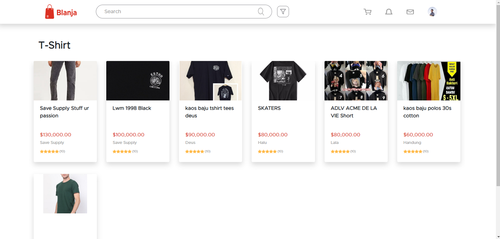
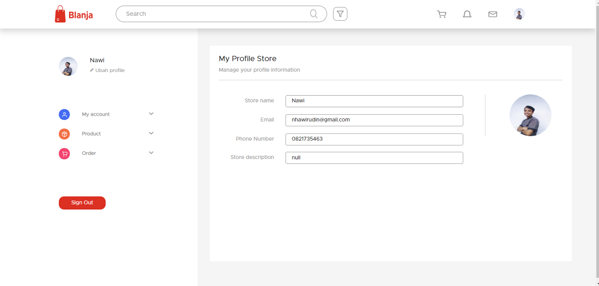

<h1 align="center">Blanja</h1>

## Table of Contents

- [Table of Contents](#table-of-contents)
- [Introduction](#introduction)
- [Built with:](#built-with)
- [Features](#features)
- [Requirements](#requirements)
- [Usage for development](#usage-for-development)
- [Screenshots](#screenshots)
- [Demo](#demo)
- [Contributors](#contributors)

## Introduction
<b>Blanja</b> is a web-based marketplace application (clothes product). This application allows users to sell their products and also buy existing products. This Blanja application was built using ReactJs for the frontend, NodeJS and ExpressJS for the backend, and MySQL for the database.

## Built with:
- [React js](https://reactjs.org/)
- [Node js](https://nodejs.org/en/)
- [Express js](https://expressjs.com/)
- [MySQL](https://www.mysql.com/)
- [Bootstrap](https://getbootstrap.com/)

## Features
* User can buy and sell some cloth product
* Cashier can handle(print or send email) order list of customer
* Seller can add, modify, delete and edit menus.
* And others

## Requirements
* [`npm`](https://www.npmjs.com/get-npm)
* [`react-js`](https://reactjs.org/)

## Usage for development
1. Open your terminal or command prompt
2. Type `git clone https://github.com/NawiOne/BLANJA_YEAH.git`
3. Open the folder and type `npm install` for install dependencies
4. Type `npm start` for run this app.

## Screenshots

     
    
     
    

## Demo
[Blanja](2.91.11.189:8080/)

## Contributors

  <table>
    <tr>
      <td align="center">
        <a href="https://github.com/NawiOne">
           
          <b>Nawirudin</b>
        </a>
      </td>
      <td>
        <a href="https://github.com/GustiAmelia">
           
          <b>Gusti Amelia</b>
        </a>
      </td>
      <td>
        <a href="https://github.com/wildandhya">
           
          <b>Wildan Dhya</b>
        </a>
      </td>
      <td>
        <a href="https://github.com/YusupJunaedi">
             
            <b>Yusup Jun</b>
        </a>
      </td>
  </table>

